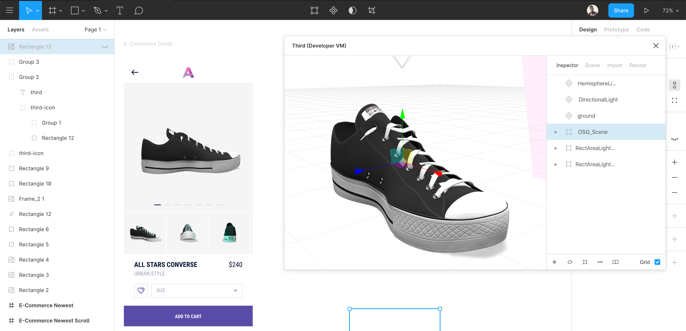

[](https://github.com/ahkohd/FigmaDither/workflows/ProdBuild/badge.svg)

A Figma plugin that lets you import, lit, use and render 3D models right there in Figma 🙈

# 💡 Features

-   ⚡ A viewport to interact with 3D models.
-   🔥 High resolution and transparent rendering.
-   😽 Easy to use UI.
-   ✨ Supports multiple 3D Object model format for import.
-   🚀 Light weight, powered with Three.JS

# 🎥 Demo

A demo showing the use of Third to render a All Star Converse kicks into a project Figma.


All Star Converse Kicks 3D model by
[Pedro França](https://sketchfab.com/3d-models/all-star-converse-f3428b2583a0415c99b3b08feee48d79)

# 📸 Screenshots

Figma Third in action 🔥



# ☕️ Donate

<a href="https://www.buymeacoffee.com/jwlE0N8" target="_blank"></a>

# 💻 Development

First clone this repository.

```bash
$ git clone https://github.com/ahkohd/FigmaThird.git
$ cd FigmaThird
```

Install dependencies & build files to start local development.

```bash
$ npm install
$ npm start
```

# 🧾 LICENSE

[MIT](./LICENSE.md)
